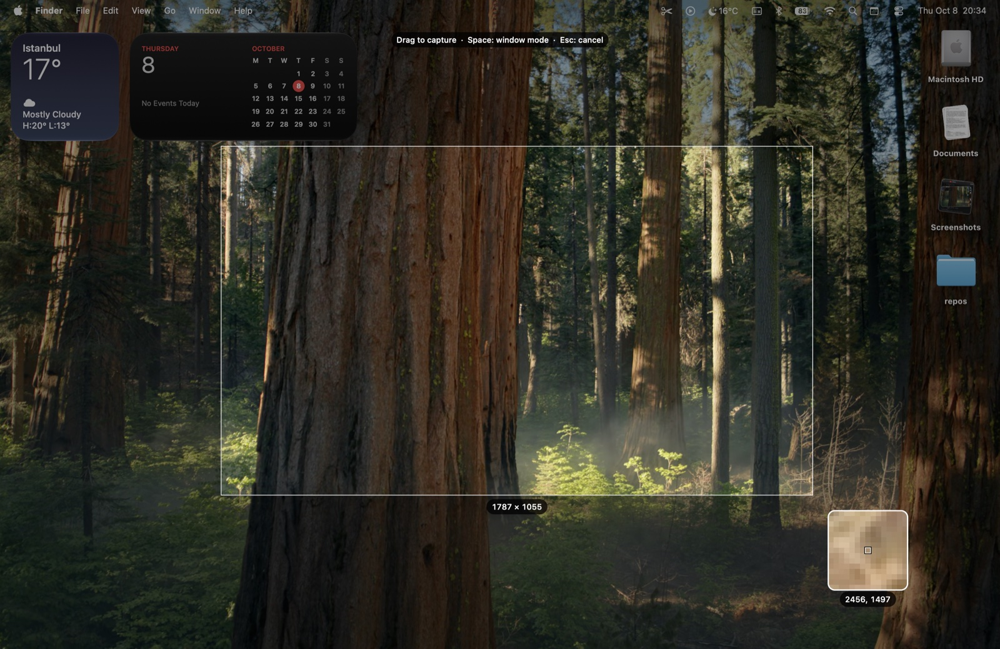
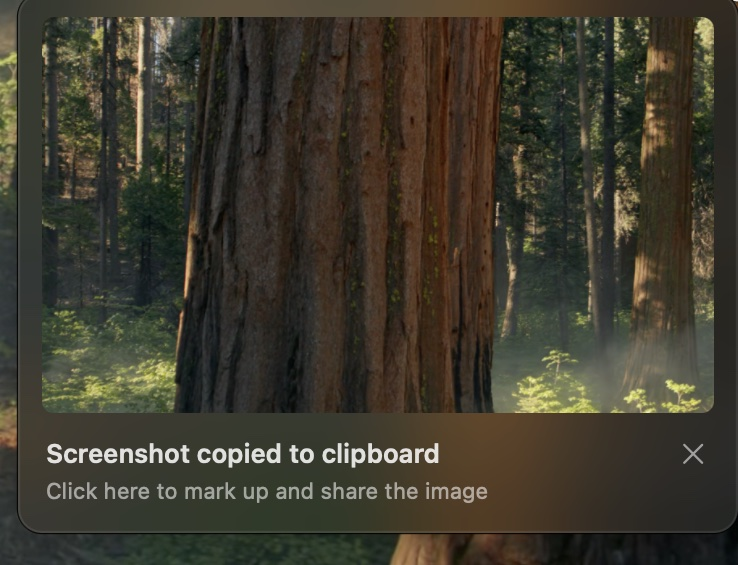
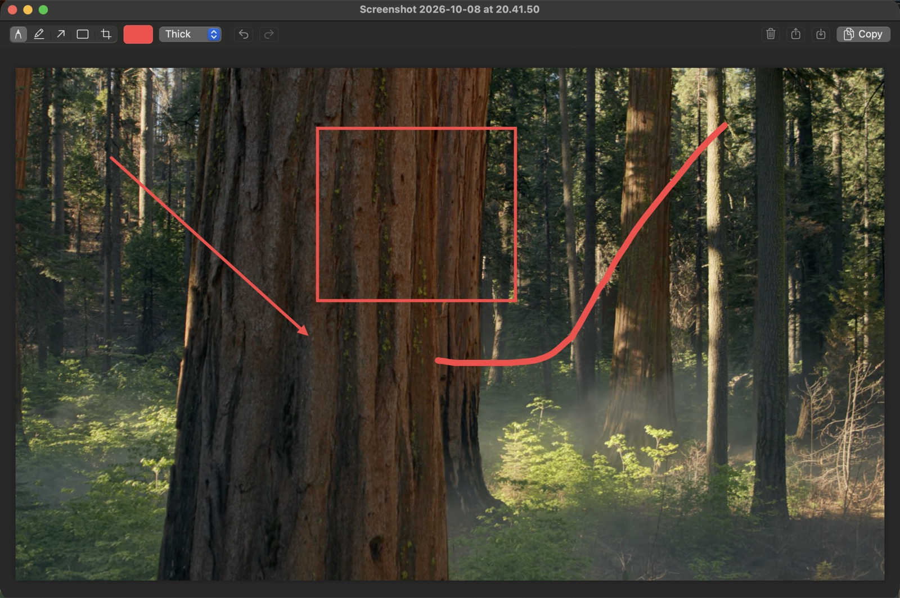

# Snip

**The Windows Snipping Tool workflow, on macOS.** Press a shortcut, select an area, and the
screenshot is already on your clipboard. A notification pops up in the corner: click it to
mark up the image, or just ignore it and paste.

Snip is a small native menu-bar app (Swift, AppKit, ScreenCaptureKit) with no dependencies.

  

  
  &nbsp;&nbsp;
  

## Features

- **Instant clipboard:** every capture is copied right away, with no floating thumbnail to wait for.
- **Click-to-edit notification** in the bottom-right corner, just like on Windows.
- **Frozen-screen selection:** the screen freezes when you press the shortcut, so menus and
  hover states stay put while you select. A magnifier and live pixel size help you be precise.
- **Window capture** grabs a window on its own, even when other windows overlap it.
- **Editor:** pen, highlighter, arrow, rectangle and crop (keys 1–5), color, stroke width,
  undo/redo, Copy, Save, Share and Delete. Every edit is copied to the clipboard automatically.
- **Auto-save** to `~/Pictures/Screenshots` (can be turned off), and launch at login.

| Shortcut | Action |
|---|---|
| ⌥⇧S | Capture a region (Space switches to window mode, Esc or right-click cancels) |
| ⌥⇧W | Capture a window |
| ⌥⇧F | Capture the full screen under the pointer |

In the editor: ⌘C copy, ⌘S save, ⌘Z / ⇧⌘Z undo/redo, ⌘⌫ delete, ⌘W close.

## Requirements

macOS 14 (Sonoma) or later, and Xcode or the Xcode Command Line Tools to build.

## Build and install

    git clone https://github.com/erentknn/snip-mac.git
    cd snip-mac
    ./build.sh --install    # builds, copies to /Applications and launches

`./build.sh` alone builds `build/Snip.app` without installing.

On first capture, allow Snip under **System Settings → Privacy & Security → Screen & System
Audio Recording**, then quit and reopen Snip. macOS also asks every few weeks whether Snip
may "bypass the system private window picker". That's normal for any screenshot app that
captures without a picker.

### Code signing and the permission prompt

`build.sh` signs with your first "Apple Development" certificate if you have one (override
with `SIGN_IDENTITY=…`), so macOS remembers the Screen Recording permission across rebuilds.
Without a certificate it falls back to ad-hoc signing, and macOS asks again after every
rebuild. If it keeps asking even though Snip is enabled in System Settings, clear the stale
entry and grant it again:

    tccutil reset ScreenCapture dev.eren.snip

## Using ⌘⇧4 instead

Turn off the system shortcut in System Settings → Keyboard → Keyboard Shortcuts →
Screenshots, then change the hotkeys in `Sources/Snip/AppDelegate.swift`.

## Project layout

| Path | What it does |
|---|---|
| `Sources/Snip/AppDelegate.swift` | Menu bar, hotkeys, what happens after a capture |
| `Sources/Snip/Capture.swift` | ScreenCaptureKit capture and the selection overlay |
| `Sources/Snip/Toast.swift` | The bottom-right notification |
| `Sources/Snip/Editor.swift` | The markup editor |
| `scripts/make_icon.swift` | Draws the app icon; run `./scripts/make_icon.sh` to regenerate `Resources/AppIcon.icns` |

## License

[MIT](LICENSE)
